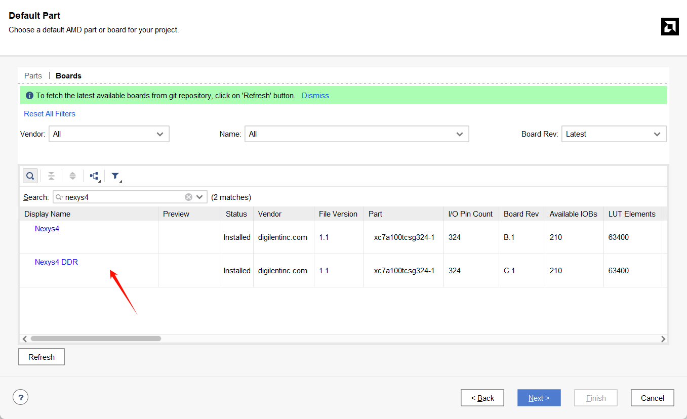

## 安装vivado
参考[安装教程](pdf/1.课前准备——Vitis开发套件下载安装.pdf)

## 添加板卡文件

将`board`文件夹中的文件夹复制到安装路径下的`board_files`文件夹中，如`E:\Xilinx\Vivado\2023.1\data\boards\board_files`。

## 创建工程
参考[创建工程](pdf/2.%20创建第一个工程.pdf)中的**选择工程类型**之前的部分，完成板卡文件添加后，选择

> 注意不要点击`Nexys4 DDR`字体部分，点击这一行的空白部分后，next下一步即可。

## 项目中的引脚约束

建议使用[Nexys-4-DDR-Master.xdc](constraints/Nexys-4-DDR-Master.xdc)，在项目中添加该约束文件后，将对应部分取消注释（删除行首的#），修改对应的port名即可。
