# 创建Vivado工程

## 新建工程

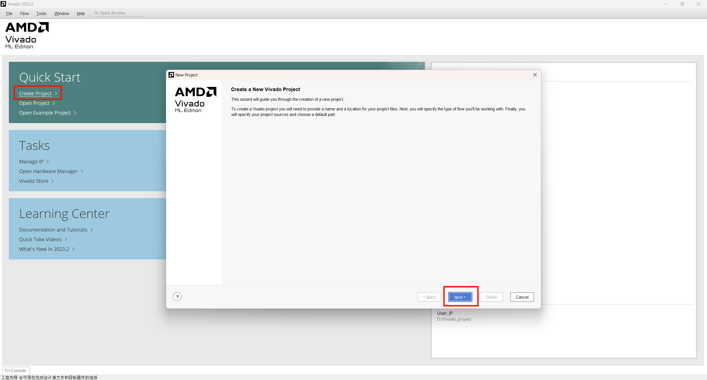

## 工程名&路径

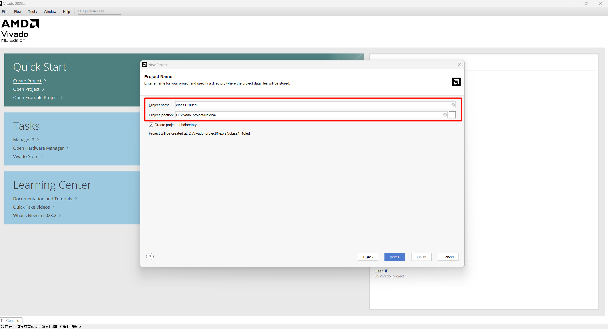

## 选择工程类型

> 保持默认即可

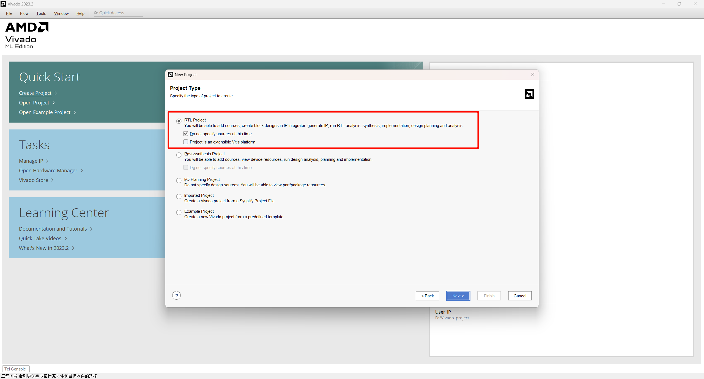

## 选择开发板

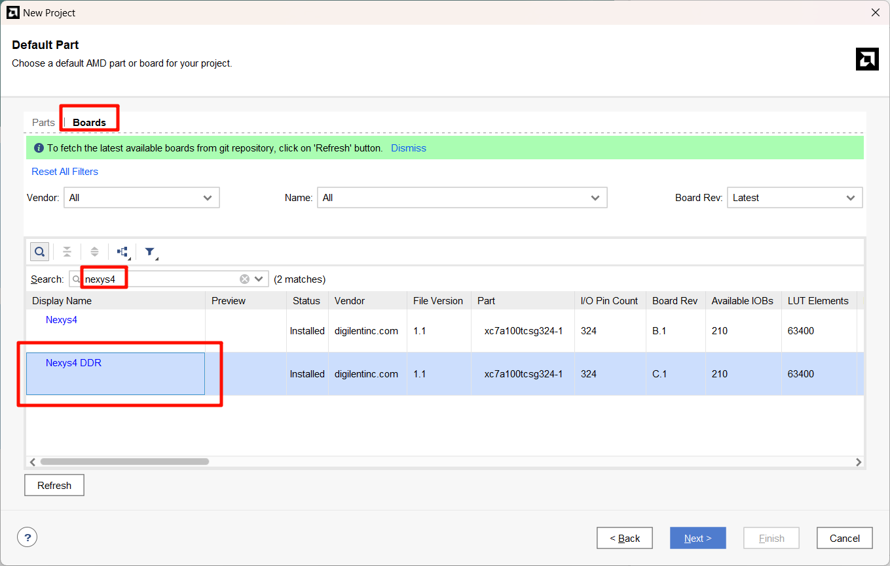

## 完成创建

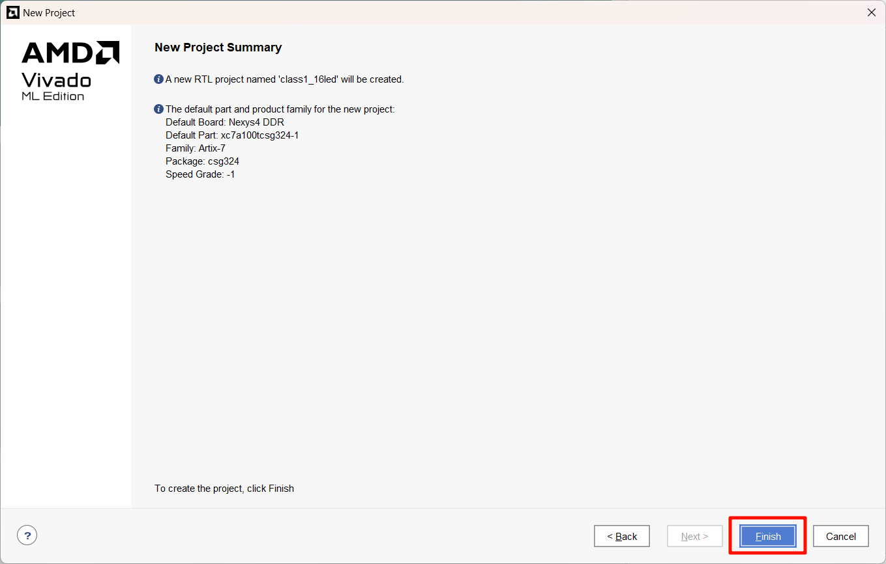

## 添加源文件

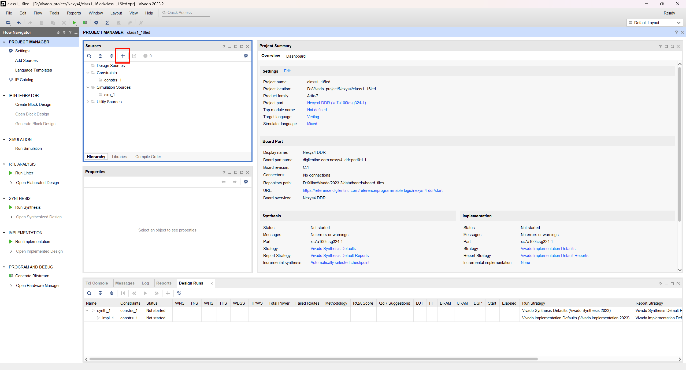

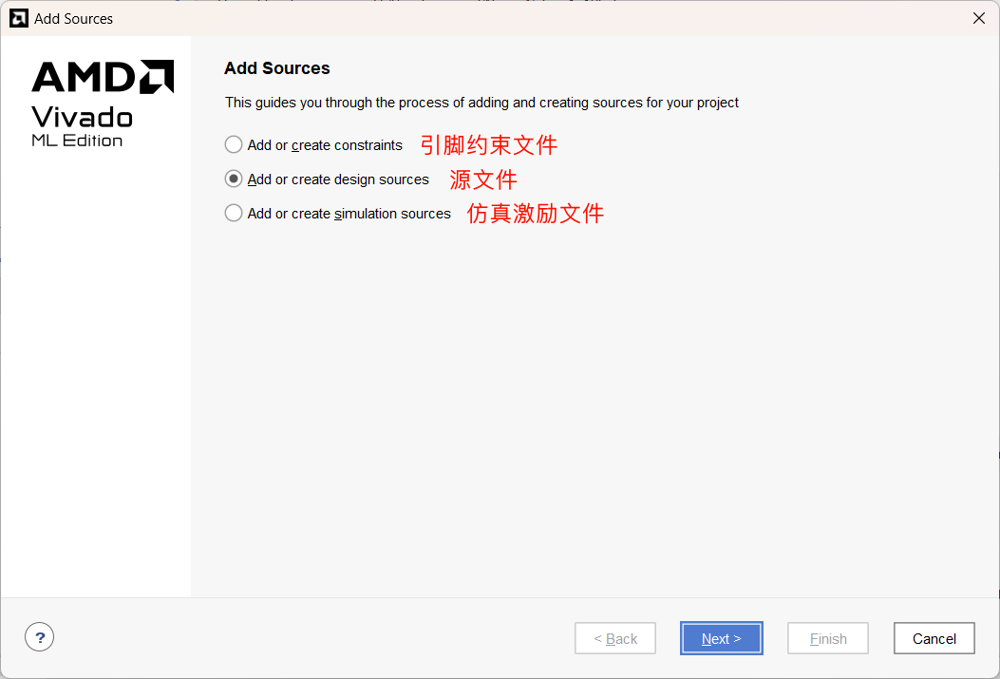

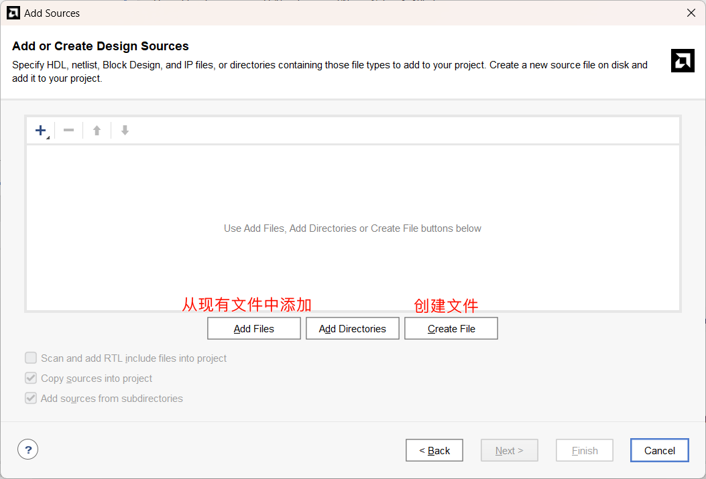

## 行为级仿真

## 添加激励文件

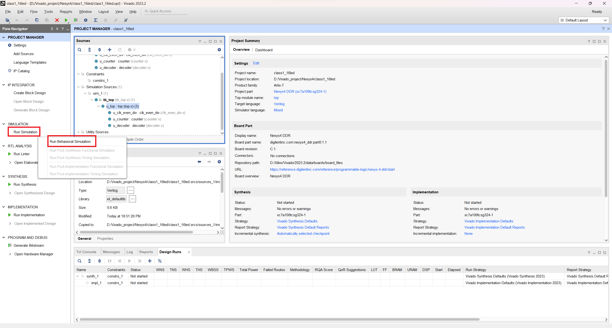

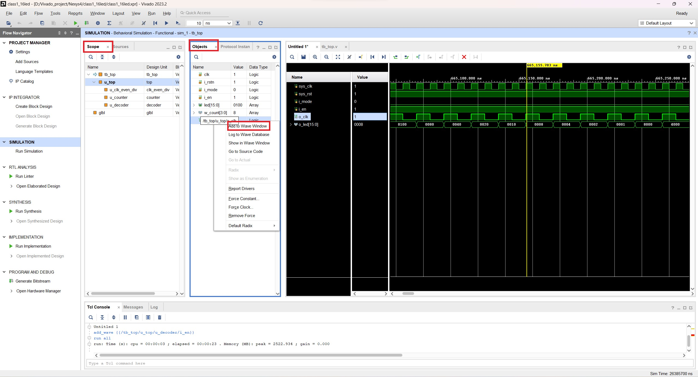

> 在scope中选择对应的模块后，在Objects中选择对应的信号右击，即可添加信号至波形窗口

## 添加引脚约束文件

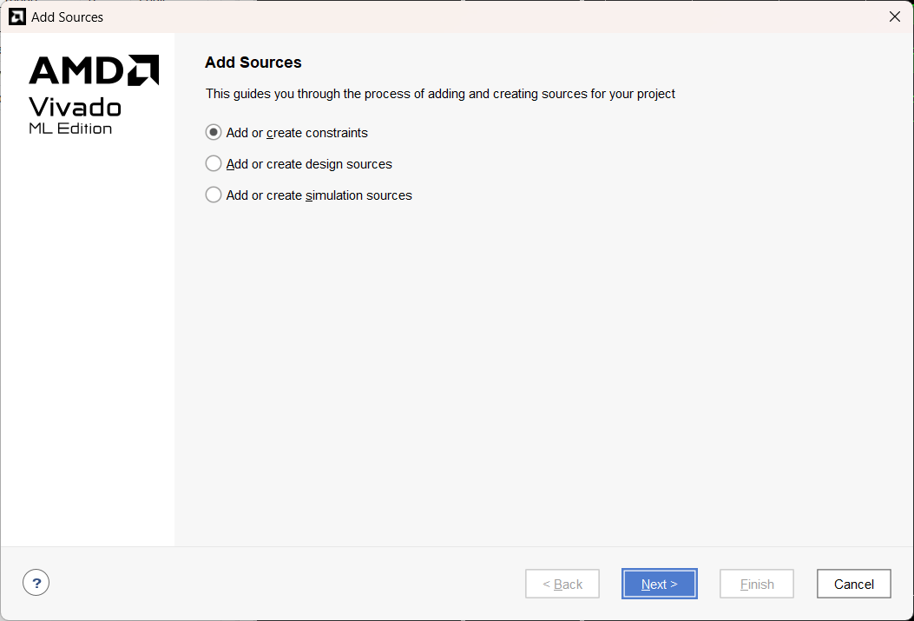

> 使用[Nexys-4-DDR-Master.xdc](constraints\Nexys-4-DDR-Master.xdc)文件，取消所用到的引脚所在行的注释，修改端口名与模块的端口名对应。
>
> 使用方法也在该文件中的开头提到：
> This file is a general .xdc for the Nexys4 DDR Rev. C
> To use it in a project:
>
> 1. uncomment the lines corresponding to used pins
> 2. rename the used ports (in each line, after get_ports) according to the top level signal names in the project

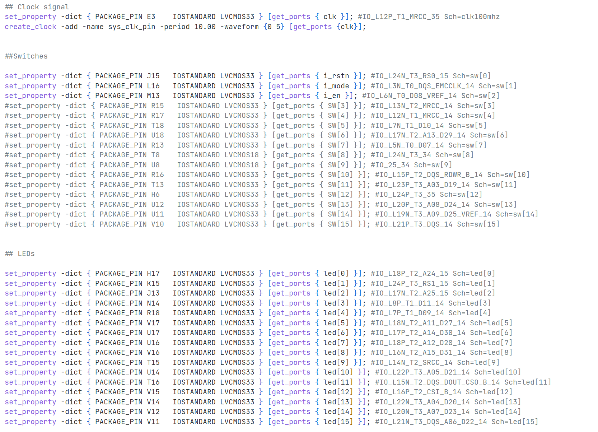

## 分析、综合、实现、生成比特流

> 依次完成以下步骤

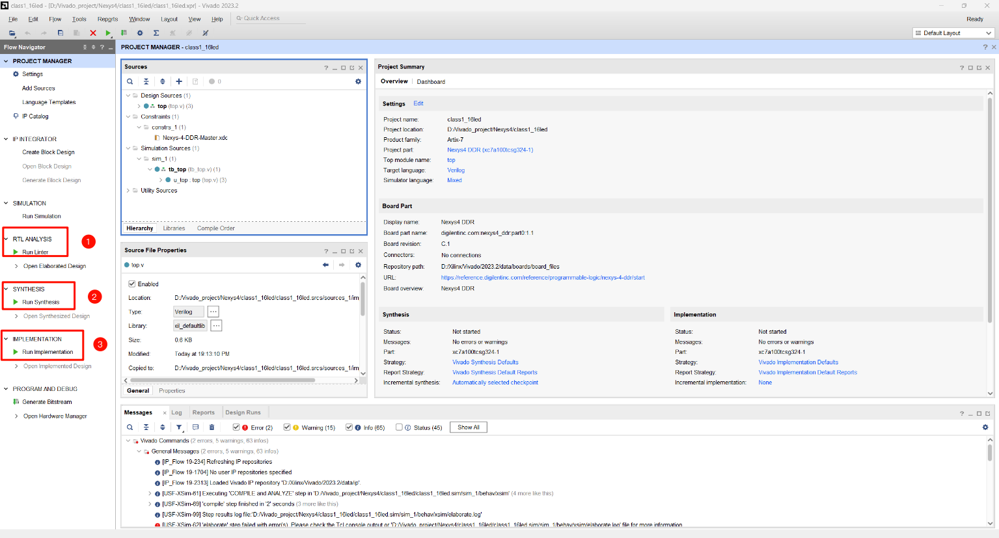

当以上三个步骤完成后，生成硬件流

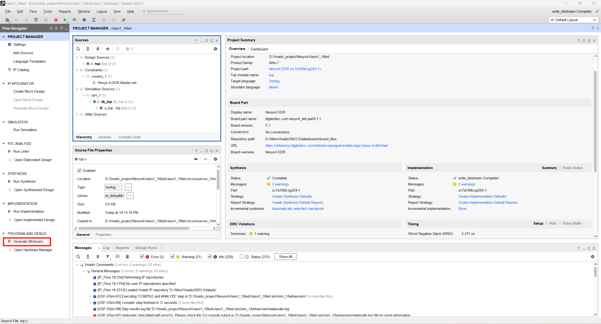

## 下载程序到开发板上

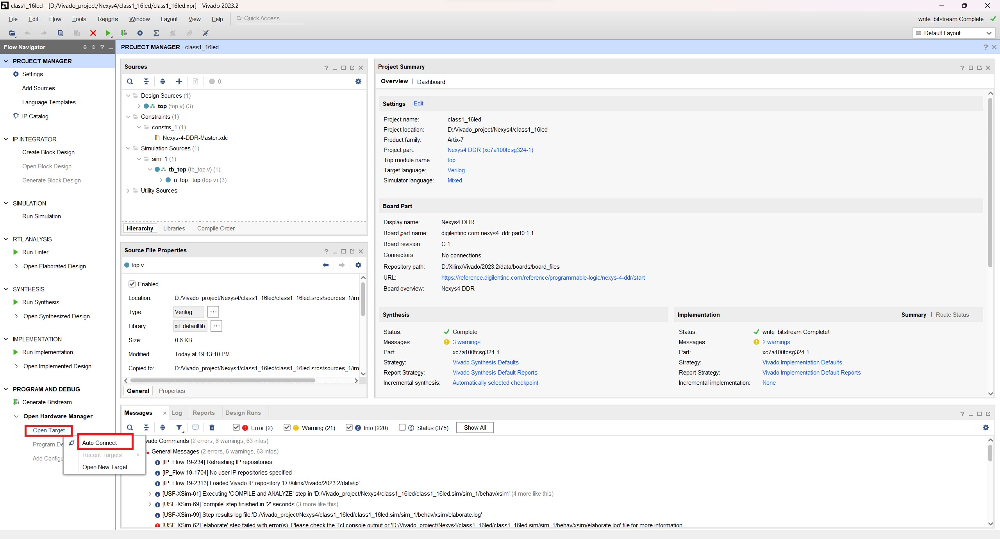

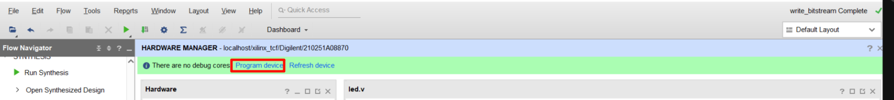

静待完成即可
